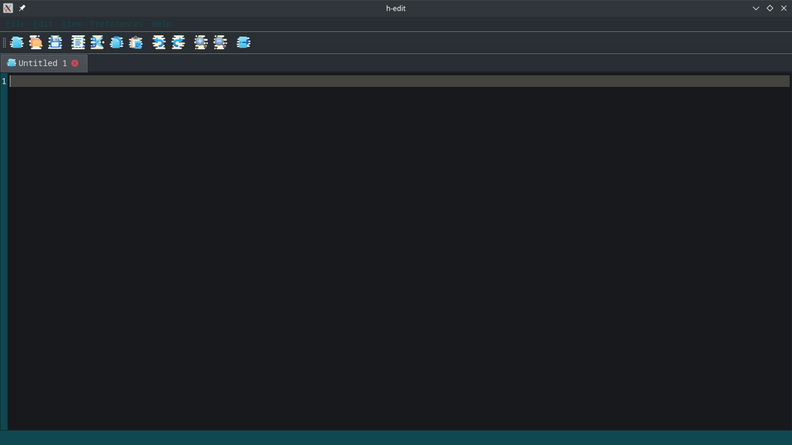
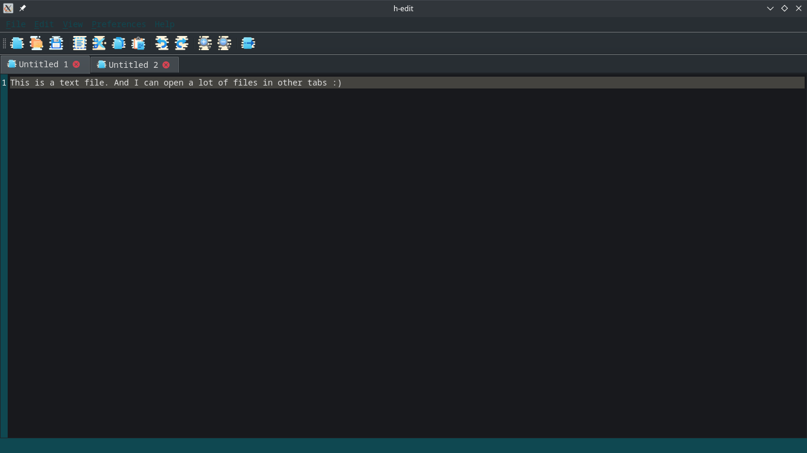

# h-edit
A simple text editor in C++ with Qt 5

## Requirements
You should have Qt(>= 5 ) installed on your system. See [qt.io](https://qt.io).

## Setup
```bash
git clone https://github.com/tobihans/h-edit.git
cd h-edit # Or replace `h-edit` with the name you give to the clone directory.
qmake -project
qmake
make
```

If you don't want to compile manually, you can open the project in Qt Creator IDE.

## Screenshots


